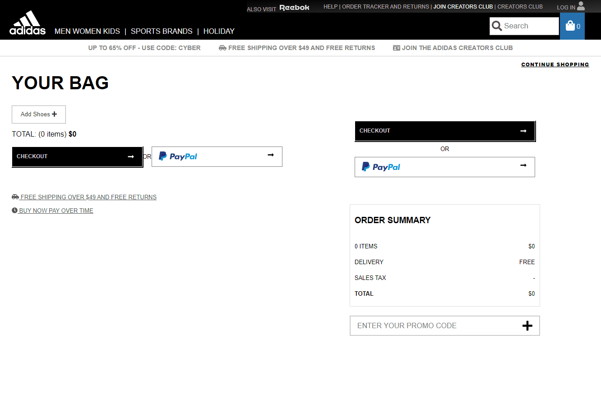

# Adidas - Tappin Challenge

Run `npm install`
...
`npm start` then
navigate to http://localhost:8080

Start by clicking the "Add Shoes" button

You can then remove the products or update the quantities. All the prices and values will reflect the changes.

Built using React

Pipeline built using Github Actions. Check in to master branch will trigger `npm install` and `npm run build` and will deploy the output files which are hosted [here https://alextappin.github.io/TappinChallenge](https://alextappin.github.io/TappinChallenge)

The builds are also archived in the [Actions](https://github.com/alextappin/TappinChallenge/actions) tab

### Issues
There is currently a CORS issue. There is no Access Control Allow Origin header on www.adidas.com/api therefore requests will fail unless you manage to turn off Chrome security `--disable-web-security`. Since a cookie is being set in the response, adding `Access-Control-Allow-Origin: *` will not work, but adding `Access-Control-Allow-Origin: alextappin.github.io` or `http://localhost:8080` for local development should yield results.

If you manage to turn off Chrome security, the APIs will work briefly until they begin to return 403 (Access Denied) presumably because we are hitting the API too often (might be hitting a cap?) After visiting https://www.adidas.com/us/cart and sometimes clearing cookies, the APIs start working again.

Documentation with the .yaml doc provided is not up to date (shows to use http://adidas.com/api when http://www.adidas.com/api is necessary). Hitting the APIs in the Swagger editor is throwing errors due to the CORS issue listed above.

Overall was an enjoyable challenge to work on, but spent most of the time troubleshooting the API issues.
